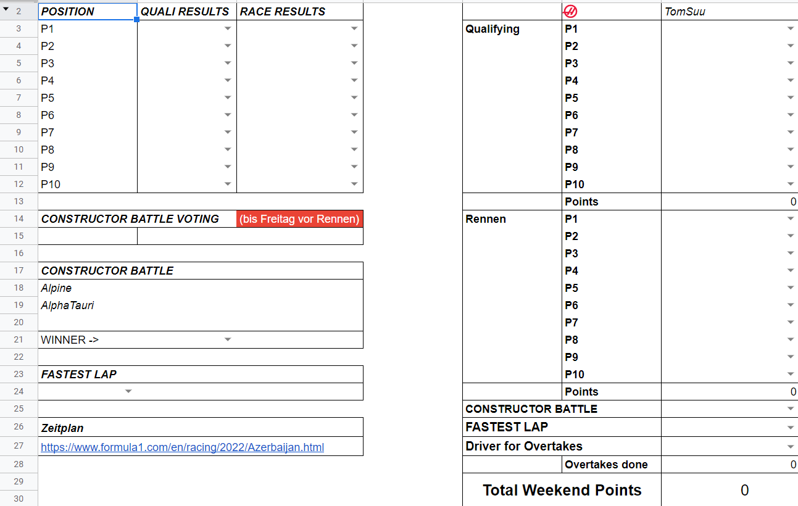

# Project to automate a Google Spreadsheet for F1 Fantasy Tipping

This project uses the fastf1 package and google spreadsheet api package, to calculate the metrics
used in a custom f1 fantasy sheet and enter them in the sheet.

# Metrics calculated

The script calculates different categories besides the top 10 from the qualifying and the race.

Those are predefined in the Google Spreadsheet with this given structure:



So we have the following Metrics:

* Top 10 Qualy
* Top 10 Race
* Constructor Battle
    - Battle between 2 or 3 teams who finishes better after the race
* Fastest Lap
* Driver for Overtakes
    - Here a player can select a driver for which the positional difference from grid to race end determines the points he gets times a multiplier

# How to run it
(WIP! First you need to set up a mail that serves for the google spreadsheet api to enter and read stuff.) 

Then you can start the script in the following way:
```bash
python main.py <Race Name> <Session>
```

Here `<Race Name>` stands for the city of the Race

-> Imola, Monaco, Bahrain etc.

and `<Session>` is an optional argument.
If we give `Q` as a argument, the script only enters the qualyfying position.

If we give `R` as a argument, the script enters everything besides the qualyfying positions.

If we don't give `<Session>` something it automatically enters everything.